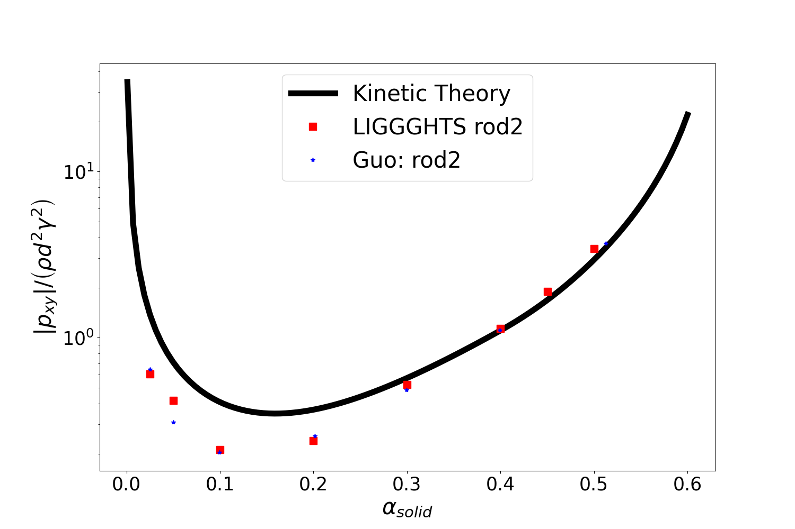
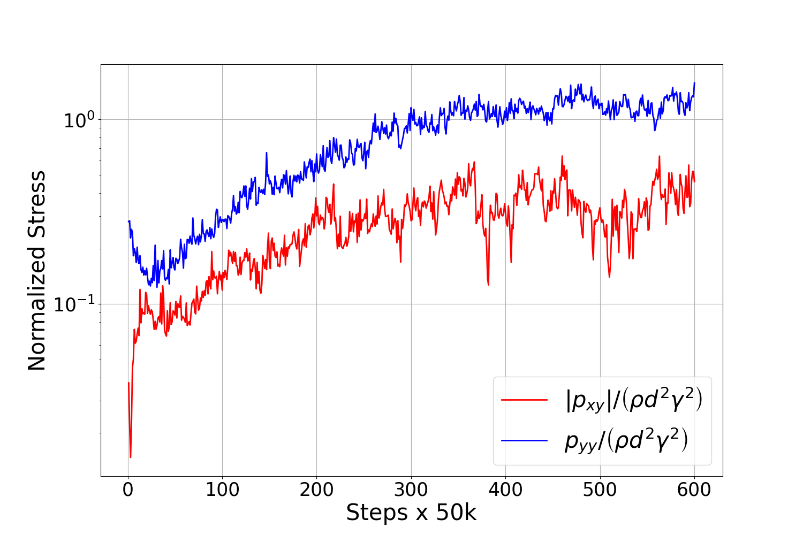
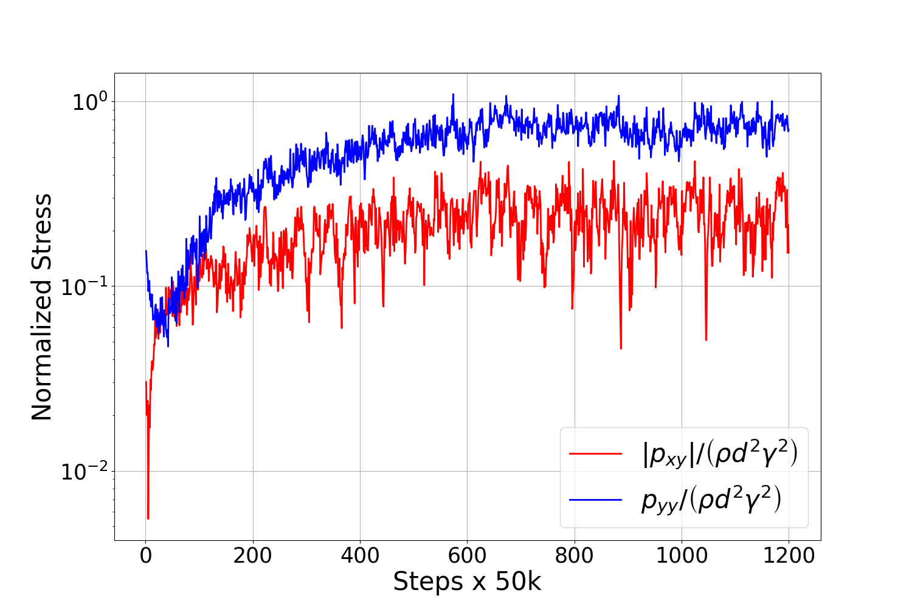
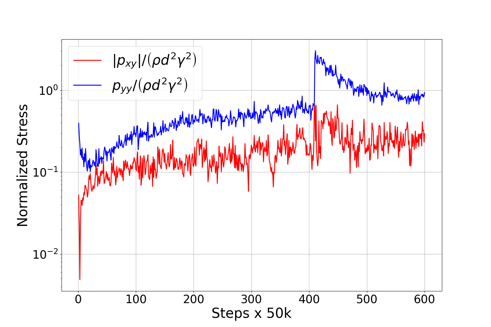
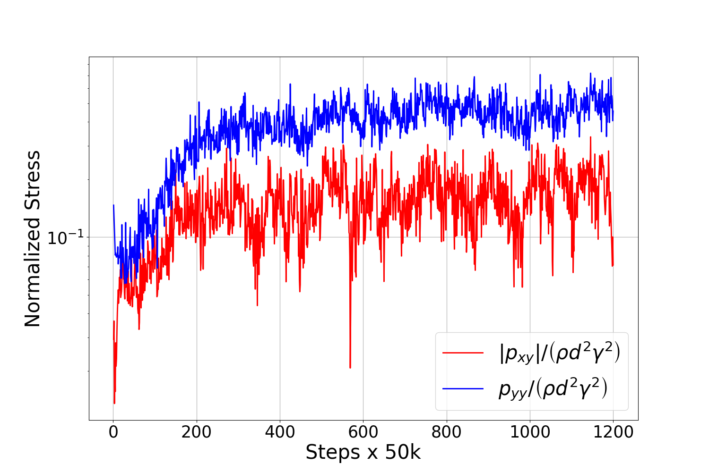

## LEBC Results

This readme should have the results of the code in this github repo for the following particles
- [Single_Sphere](#singlesphere)
- [Rod2](#rod2)
- [Rod4](#rod4)
- [Rod6](#rod6)
- [Multisphere13](#multisphere13)
- [Mixture of Multi and Single Sphere](#mixture)

(todo: add images of these particles, it'll look nice)

# Single Sphere

### Stress vs Volume Fraction

 

 

### Stress vs Time Results

| Volume Fraction | Stress vs Time |
| ------------- | ------------- |
| 0.05 |    |
| 0.13 |    |
| 0.23 |    |
| 0.32 |    |
| 0.41 |    |
| 0.50 |    |

# Rod2

### Stress vs Volume Fraction

 

 

### Stress vs Time Results

| Volume Fraction | Stress vs Time |
| ------------- | ------------- |
| 0.025|    |
| 0.05 |    |
| 0.1  |    |
| 0.2  |    |
| 0.3  |    |
| 0.4  |    |
| 0.45 |    |
| 0.50 |    |

# rod4

### Stress vs Volume Fraction

 

 

### Stress vs Time Results

| Volume Fraction | Stress vs Time |
| ------------- | ------------- |
| 0.025|    |
| 0.05 |    |
| 0.1  |    |
| 0.2  |    |
| 0.3  |    |
| 0.4  |    |
| 0.45 |    |
| 0.50 |    |

# rod6

### Stress vs Volume Fraction

 

 

### Stress vs Time Results

| Volume Fraction | Stress vs Time |
| ------------- | ------------- |
| 0.025|    |
| 0.05 |    |
| 0.1  |    |
| 0.2  |    |
| 0.3  |    |
| 0.4  |    |
| 0.45 |    |
| 0.50 |    |

# Multisphere13
ran with MPI 4 4 2

### Stress vs Volume Fraction

 

 

### Stress vs Time Results

| Volume Fraction | Stress vs Time |
| ------------- | ------------- |
| 0.05 |    |
| 0.13 |    |
| 0.23 |    |
| 0.32 |    |
| 0.41 |    |
| 0.50 |    |

# Multisphere13 with Same Size Single Sphere
ran with MPI 4 4 2
> Warning: bug in lebc.py for mixtures is causing particles to not get inserted at high volume fractions. This test needs reran after lebc.py is fixed for mixtures.

### Stress vs Volume Fraction

 

 

### Stress vs Time Results

| Volume Fraction | Stress vs Time |
| ------------- | ------------- |
| 0.05 |    |
| 0.13 |    |
| 0.23 |    |
| 0.32 |    |
| 0.41 |    |
| 0.50 |    |

